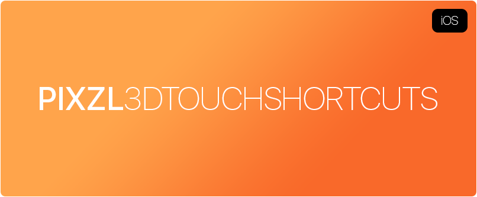
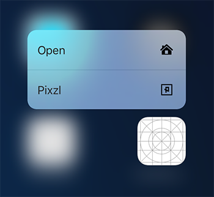

[](LICENSE)

3D Touch Homescreen Shortcuts

## Screenshot


## How to Install

You need Xcode 8 or later and an iOS device running at least iOS 9.

Step 1

Open a new terminal window in OS X. Refer to [this guide](http://blog.teamtreehouse.com/introduction-to-the-mac-os-x-command-line) on using the OS X Terminal.

```bash
git clone https://github.com/Pixzl/Pixzl3DTouchShortcuts
```

Step 2

```bash
  cd Pixzl3DTouchShortcuts
```

Step 3

Open `Pixzl3DTouchShortcuts.xcodeproj` in Xcode.


Step 4

Build and run the application.

(When you running this application on a device you will need to add a signing profile in the project's Build Settings.)


## Tested

- iPhone 7 Plus running iOS 10.0.2
- iPhone 7 running iOS 10.1

## Device Compatibility

- iPhone
